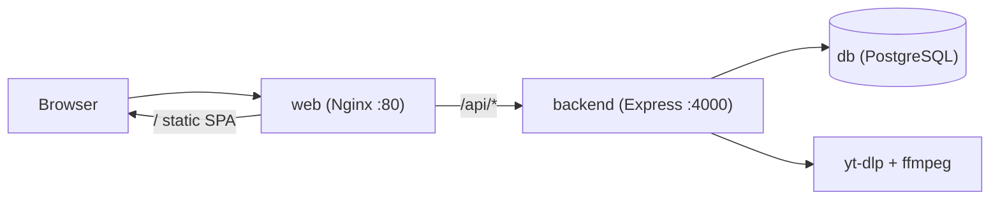

# Deploying DownloadHub Pro to a VPS

The whole stack (PostgreSQL + Express/yt-dlp backend + Nginx-served React SPA)
runs with a single `docker compose up`. Everything is self-contained — no
external database or auth service required.



## 1. Prerequisites on the VPS

- A Linux VPS (Ubuntu/Debian recommended) with a public IP.
- Docker Engine + Compose plugin:

```bash
curl -fsSL https://get.docker.com | sh
sudo usermod -aG docker "$USER"   # then log out/in so docker works without sudo
```

## 2. Get the code & configure

```bash
git clone <your-repo-url> downloaderpro
cd downloaderpro
cp .env.example .env
nano .env
```

In `.env` you MUST set:

- `JWT_SECRET` — generate one: `openssl rand -base64 48`
- `POSTGRES_PASSWORD` — a strong password.

Optional:

- `CORS_ORIGIN` — set to `https://yourdomain.com` (or leave `*`).
- `WEB_PORT` — defaults to `80`.
- `COOKIE_SECURE` — keep `false` until HTTPS is set up (step 5), then `true`.

## 3. Build & start

```bash
./deploy.sh
# or directly:
docker compose up -d --build
```

On first boot the backend automatically:

1. waits for PostgreSQL to be healthy,
2. applies the schema (`prisma db push`),
3. seeds two accounts:
   - admin: `admin@downloadhub.com` / `admin123`
   - user: `user@downloadhub.com` / `user123`

> Change the admin password after first login (or edit `backend/prisma/seed.ts`).

Visit `http://<your-server-ip>` (or your domain).

## 4. Useful commands

```bash
docker compose ps                 # status
docker compose logs -f backend    # backend logs
docker compose down               # stop (keeps the db volume)
docker compose up -d --build      # rebuild after pulling new code
docker compose exec db psql -U downloadhub downloadhub   # open a DB shell
```

Data lives in the named volumes `pgdata` (database) and `downloads_tmp`
(transient download workspace). `docker compose down` keeps them; add `-v` to wipe.

## 5. HTTPS (recommended)

Put a TLS terminator in front of the `web` container. Easiest is Caddy:

1. Set `WEB_PORT=8080` in `.env` so Nginx is internal, and `COOKIE_SECURE=true`.
2. Install Caddy on the host and use a `Caddyfile`:

```
yourdomain.com {
    reverse_proxy localhost:8080
}
```

Caddy auto-provisions a Let's Encrypt certificate. Alternatively use Nginx +
Certbot or your provider's load balancer. Once HTTPS is live, keep
`COOKIE_SECURE=true` so the session cookie is only sent over TLS.

## 6. Keeping yt-dlp fresh

yt-dlp needs periodic updates for site changes. Rebuild the backend image to
pull the latest:

```bash
docker compose build backend && docker compose up -d backend
```
